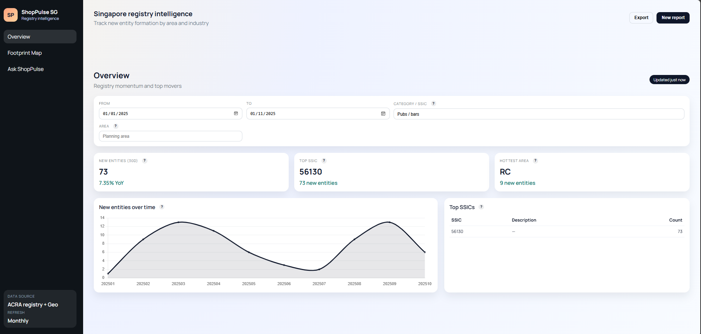
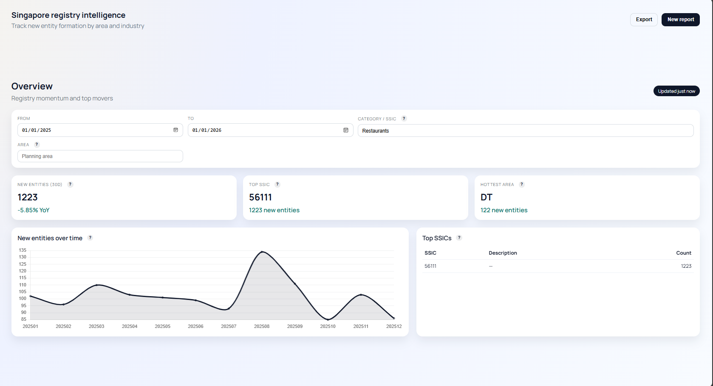
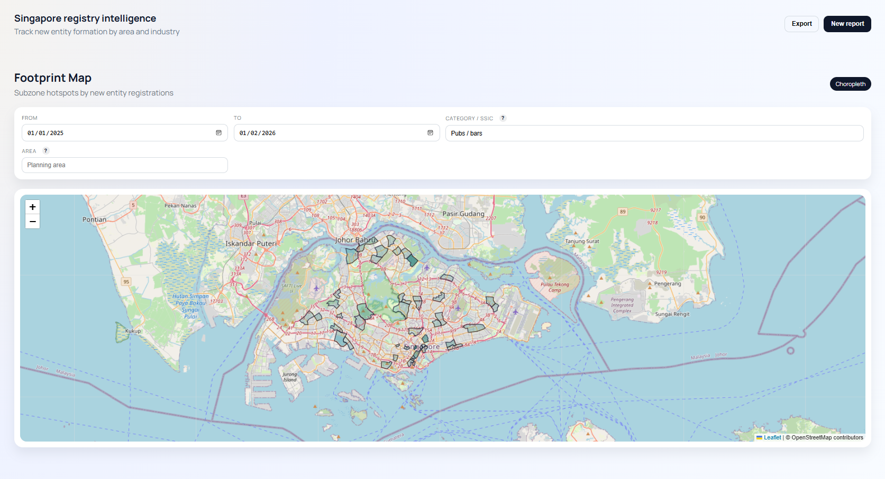
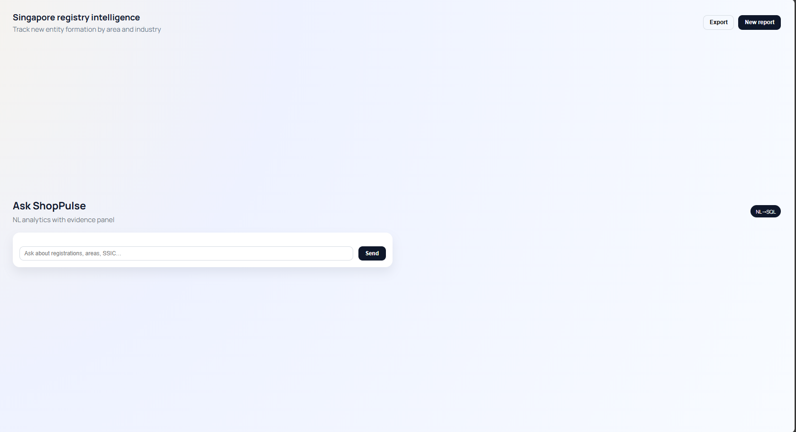

# ShopPulse SG

Registry intelligence for Singapore: track where new businesses are forming, drill into industries and explore hotspots by subzone.



## Highlights
- Real public registry data (ACRA) with a reproducible data contract and audit report
- ClickHouse OLAP model (raw / enriched / materialized views)
- Geo-enrichment (postal / lat/lon / subzone/planning area)
- Analytics UI with filters, map hotspots and NL to SQL exploration (WIP)
- End-to-end pipeline in Docker (backend + frontend + database)

## Live demo (local)
- Frontend: http://localhost:4200
- Backend: http://localhost:8000
- Health: http://localhost:8000/health
- ClickHouse: http://localhost:8123
- ClickHouse UI: http://localhost:5521

ClickHouse creds (docker-compose):
- user: default
- password: shoppulse

If CH-UI shows a connect screen, clear LocalStorage for http://localhost:5521 or open an Incognito window.

## Screenshots to add (suggested)
1) **Overview dashboard**
   - KPI cards, trend chart, top SSICs list
   - 
2) **Footprint map**
   - choropleth by subzone with tooltip counts
   - 
3) **Ask ShopPulse (WIP)**
   - question + narrative + SQL preview (work in progress)
   - 

## Key features
- **ACRA data ingestion**: automatic dataset discovery + pagination
- **Data contract**: strict column selection + cleaning rules
- **ClickHouse schema**: MergeTree tables + materialized views for fast analytics
- **Geo enrichment**: OneMap geocoding + point-in-polygon tagging
- **Analytics API**: trends, rankings, hotspots, entity search, details
- **NL?SQL layer**: intent + slot extraction with safe SQL templates

## Architecture (high level)
```
Frontend (Angular)
   FastAPI API
      ClickHouse (OLAP + MVs)
      GeoJSON + OneMap geocoder
```

## Stack
- Backend: FastAPI (Python 3.12)
- Frontend: Angular + TypeScript
- Database: ClickHouse
- Infra: Docker + Docker Compose

## Quick start (Docker)
```bash
cd infra
docker compose up --build
```

## Data pipeline (Phase 1?2)
Generate cleaned ACRA CSV from local files:
```bash
python scripts/fetch_acra_collection.py --use-local --input-dir data/raw --out data/processed/acra_entities_cleaned.csv
```

Run the ClickHouse pipeline (schema + dims + raw + enriched):
```bash
python scripts/run_pipeline.py --acra-csv data/processed/acra_entities_cleaned.csv --subzone-geojson data/map/MasterPlan2019SubzoneBoundaryNoSeaGEOJSON.geojson --planning-geojson data/map/MasterPlan2025PlanningAreaBoundaryNoSea.geojson --truncate --recreate
```

Run geo-enrichment (postal ? lat/lon ? subzone/planning area):
```bash
python scripts/geo_enrich.py --subzone-geojson data/map/MasterPlan2019SubzoneBoundaryNoSeaGEOJSON.geojson --planning-geojson data/map/MasterPlan2025PlanningAreaBoundaryNoSea.geojson --limit 20000 --sleep 0.05 --concurrency 16 --batch-size 500 --refresh-enriched --loop --mark-failed
```

## API surface (core)
- `GET /health`
- `GET /api/overview`
- `GET /api/trends/new-entities`
- `GET /api/rankings/top-ssic`
- `GET /api/map/hotspots`
- `GET /api/entities/search`
- `GET /api/entities/{uen}`
- `POST /api/chat/query` (WIP)
- `POST /api/chat/sql-only` (WIP)

## Repo structure
```
shoppulse-sg/
  backend/
  frontend/
  infra/
  docs/
  scripts/
  data/
```

## What this demonstrates
- Data modeling and warehouse design (ClickHouse)
- Reliable ingestion + data quality rules
- Geo enrichment pipeline and spatial analytics
- Full-stack product delivery (API + UI)
